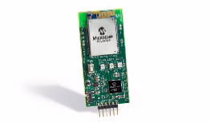
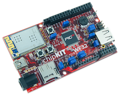

# Microchip ExositeReady™ Platforms

# 

Microchip and Exosite have teamed up to connect Microchip's wireless development kits and reference designs to the cloud. Each of the cloud devices below allow you to connect remotely through a web browser or custom application in order to manage the device and interact with real-time data. Check out the links below to learn more!

# ExositeReady™ Certified
## Microchip Wi-Fi Client Module Development Kit

The Microchip Wi-Fi Client Module (WCM) Development Kit 1 (Part Number DM182023) is designed to enable users to quickly and easily connect to a cloud based service such as Exosite's OnePlatform. The kit includes the WCM demo board utilizing a Microchip MRF24WG0MA Wi-Fi Module and a PIC32 application microcontroller.

The Microchip WCM-DK1 is the first product to be certified as ExositeReady™ which certifies that a production ready port of the ExositeReady™ Embedded SDK is available and ready for use in your application. The provided demo shows how to do the following:

* Simple Wi-Fi configuration
* Quickly activate a new device on Exosite cloud and save CIK to NVMemory
* Periodically send "Heart Beat" data to draw a triangle wave to Exosite cloud
* Send button press report to Exosite cloud to trigger an email or SMS alert
* Read "LED" data source on Exosite cloud to turn device LED1 on and off

The Wi-Fi Client Module Development Kit 1 is available from Microchip Direct or other distributors.

### Downloads and Links

* [Quick Start Guide and Source Code](https://github.com/exositeready/er_vfp_microchip_wcm)
* [Exosite's Microchip Portal](https://microchip.exosite.com/)
* [Information/Purchase - Microchip](http://www.microchipdirect.com/ProductSearch.aspx?keywords=DM182023)

# Other ExositeReady™ Platform Support

## Microchip DV102412 Wi-Fi G Demonstration Kit
The DV102412 Wi-Fi G Demonstration kit comes with MRF24WG0MA Wi-Fi module and PIC32MX695F512H processor. The Wi-Fi G Demo Board is preloaded with a demo software for the user to explore the features of the Wi-Fi module. It is also expandable through an 8-pin expansion interface, which enables the user to extend its functionality by adding various sensor expansion boards.

### Downloads and Links
* [Quick Start Guide and Source Code](https://github.com/exosite-garage/mcp_dv102412_cloud)
* [Exosite's Microchip Portal](https://microchip.exosite.com/)
* [Purchase - Microchip Direct Store](http://www.microchip.com/Developmenttools/ProductDetails.aspx?PartNO=DV102412)

## Microchip DV102412 Wi-Fi G Demonstration Kit
The Digilent chipKIT™ uC32 is an Arduino compatible platform that is based on the Microchip PIC32.  Add to this the chipKIT Wi-Fi shield or use the chipKIT WF32 which combines the PIC32 and Wi-Fi on a single board, and you have a device that can easily work with Exosite.
An example application and library have been posted as open source to create an IoT application with your PIC32 based chipKIT device and Exosite.

### Downloads and Links
* [Quick Start Guide and Source Code](https://github.com/exosite-garage/chipkit_wifi_cloud/blob/master/README.md#quick-start)
* [Exosite's Microchip Portal](https://microchip.exosite.com/)
* [Information/Purchase - Digilent](https://store.digilentinc.com/chipkit-wf32-wifi-enabled-microntroller-board-with-uno-r3-headers/)

# Getting Help

* [Exosite's Developer Forum](https://community.exosite.com/c/hardware-platforms/microchip-kits)
* [Microchip 24/7 Tech Support Website](http://www.microchip.com/wwwregister/default.aspx?ReturnURL=http://www.microchip.com/support/hottopics.aspx)
* [Microchip Support Forums](http://www.microchip.com/forums)
