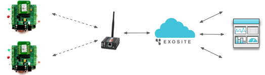
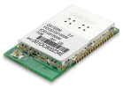
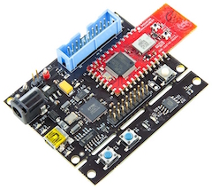

# Miscellaneous Hardware Platform Support
[< Back to ExositeReady Device Software Support Page](/exositeready)

* [MultiTech](#multitech-exositeready-platforms)
* [Qualcomm](#qualcomm-exositeready-platforms)
* [Synapse Wireless](#synapse-wireless-exositeready-platforms)
* [Gainspan](#gainspan-exositeready-platforms)
* [Broadcom](#broadcom-exositeready-platforms)

# MultiTech ExositeReady™ Platforms

# 
## Conduit Gateway
Information Coming Soon
### Downloads and Links
* [Code and Information - Please Contact support@exosite.com](https://support.exosite.com/hc/en-us/requests/new)

# Qualcomm ExositeReady™ Platforms
# 
Qualcomm and Exosite have partnered to build IoT connectivity directly into the module.  Contact us for more information.

## QCA401x
Information Coming Soon
### Downloads and Links
* [Code and Information - Please contact support@exosite.com](https://support.exosite.com/hc/en-us/requests/new)

# Synapse Wireless ExositeReady™ Platforms
# 
Synapse Wireless enabled development kits and reference designs.

## E10 and E20 SNAP Gateway Support
Exosite has worked with Synapse Wireless to create an evaluation kit based on Synapse's SNAP Connect E10 Gateway.  This E10 Gateway has an Ethernet connection and runs Linux in addition to internally having a SNAP RF Engine embedded in it so it acts as a gateway for a SNAP network to the Internet.

The evaluation kit is made up of a Synapse SNAPConnect E10 Gateway and two Synapse RF Engines running on protoboards in addition to some external sensors and LEDs.  The software for this evaluation kit can be used for any makeup of devices and is meant as an evaluation tool and reference code for your specific M2M and Internet of Things projects.  

### Downloads and Links
* [Quick Start Guide and Source Code](https://github.com/exosite-garage/synapse_m2m_evaluation_kit)
* [Exosite's Synapse Wireless Portal](https://https://synapse.exosite.com/login)

# Gainspan ExositeReady™ Platforms

# 

GainSpan and Exosite partner to bring cloud connectivity to the Internet of Things. By connecting to the cloud, devices can be monitored, managed, and controlled remotely from computers, smartphones, and tablets, allowing users to graphically interact with their devices and data through a web portal and set alerts to receive emails or SMS when a condition occurs. Each of the cloud enabled products below allow you to seamlessly connect to the cloud with minimal effort. Learn more about how these Wi-Fi modules enable your Renesas RL78G13 development kit below.

## WAB-GW-GS1500M
The GainSpan WAB-GW-GS1500M low-power Wi-Fi module enables development kits such as the Renesas RL78G13 RDK to connect wirelessly to Exosite's data platform. Support for cloud connectivity can be easily configured, and authentication of the kit is done by using the Wi-Fi module's MAC address.

## WAB-GW-GS1011M
The GainSpan WAB-GW-GS1011M low-power Wi-Fi module enables development kits such as the Renesas RL78G13 RDK to connect wirelessly to Exosite's data platform. Support for cloud connectivity can be easily configured, and authentication of the kit is done by using the Wi-Fi module's MAC address.

### Downloads and Links
* [Code and Information - Please contact support@exosite.com](https://support.exosite.com/hc/en-us/requests/new)

# Broadcom ExositeReady™ Platforms

# 

## WICED - BCM9WCD1EVAL1 Evaluation Board
Broadcom provides a full-featured WICED Development Kit and is working with partners to deliver turnkey hardware solutions to readily enable Wi-Fi connectivity in system design. The development kit enables the user to quickly and easily connect to a cloud-based service such as Exosite's OnePlatform. The kit includes the BCM9WCD1EVAL1 evaluation board utilizing a Broadcom BCM943362WCD4 Wi-Fi Module and an STM32F205RGT6 application microcontroller.

The Wi-Fi Client Module Development Kit 1 is available from [WICED WI-FI](http://community.broadcom.com/community/wiced-wifi/wiced-wifi-partners) Partners and other distributors.

### Downloads and Links
* [Code and Information - Please contact support@exosite.com](https://support.exosite.com/hc/en-us/requests/new)

# Getting Help

* [Exosite's Developer Forum](https://community.exosite.com/c/hardware-platforms)
