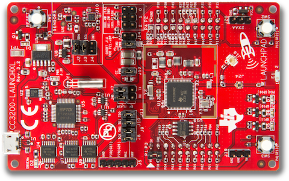

# Texas Instruments ExositeReady™ Platforms

# 
Texas Instruments enabled development kits and reference designs.

## CC3200 Wi-Fi Launchpad
Created for the Internet of Things (IoT), the SimpleLink™ CC3200 Internet-on-a-chip™ solution is a wireless MCU that integrates a high-performance ARM®Cortex™-M4 MCU allowing customers to develop an entire application with a single IC. With on-chip Wi-Fi, Internet, and robust security protocols, no prior Wi-Fi experience is needed for faster development.

The Texas Instruments CC3200-LAUNCHXL Wi-Fi Connected Launchpad is a development kit for the CC3200 wireless microcontroller. Exosite has made available a binary application that demonstrates this kit's capabilities.

This reference IoT application provides a quick way to evaluate Exosite to remotely see data, interact with your devices, and build dashboards/alerts. The Exosite free account in the ti.exosite.com domain is provided by TI and Exosite for evaluation purposes. There are no time limits. You can choose to use it as long as you want.  

Users can access the source code for the SimpleLink™ Wi-Fi® LaunchPad and compile/program different applications on the kit.  Please see the links below to find this information on TI's tools.

### Downloads and Links
* [Quick Start Guide and Source Code](https://github.com/exosite-garage/CC3200CloudDemo/tree/v2/)
* [Exosite's TI Portal](https://ti.exosite.com/)
* [Hardware Information/Purchase](http://www.ti.com/tool/cc3200-launchxl)

## EK-TM4C1294XL & EK-TM4C129EXL Crypto - Connected LaunchPads
The Texas Instruments Connected LaunchPad Evaluation Kit EK-TM4C1294XL uses the Texas Instruments Tiva™ C Series TM4C1294 microcontroller. This kit ships with Exosite application code already flashed onto the chip. Update: Texas Instruments released the Crypto Connected LaunchPad Evaluation Kit EK-TM4C129EXL in September of 2015.  

This reference IoT application code provides a quick way to evaluate an IoT platform provider and for Exosite to remotely see data, interact with your devices, and build dashboards/alerts. The Exosite free account in the ti.exosite.com domain is provided by TI and Exosite for evaluation purposes. There are no time limits. You can choose to use it as long as you want.  

Users can access the source code for the Connected LaunchPad and compile/program different applications on the kit. Please see the links below to find this information on TI's tools.

<iframe src="//www.youtube.com/embed/DZBRR7UKJUs?rel=0" width="560" height="315" frameborder="0" allowfullscreen=""></iframe>

### Downloads and Links
* [Quick Start Guide and Source Code (TI Hosted)](http://www.ti.com/lit/ml/spmz858/spmz858.pdf)
* [Exosite's TI Portal](https://ti.exosite.com/)
* [Hardware Information/Purchase](http://www.ti.com/ww/en/launchpad/launchpads-connected-ek-tm4c1294xl.html#tabs)
* [Use the Sensor Hub](http://www.ti.com/tool/boostxl-senshub) [Booster Pack](http://www.ti.com/ww/en/launchpad/boosterpacks.html) with the [Connected LaunchPad and Exosite]("https://github.com/exosite-garage/clp_sensorhub_support)

## MSP430 FRAM + CC3000 Wi-Fi with SmartConfig™
The Texas Instruments MSP430 + CC3000 Development Kit comes with Texas Instruments CC3000 Wi-Fi module and low-power MSP430 FRAM microcontroller. This kit supports SimpleLink™ Wi-Fi SmartConfig™ Technology which allows you to easily configure your wireless network setting.

The TI CC3000 module is a self-contained wireless network processor that simplifies the implementation of Internet connectivity. TI’s SimpleLink Wi-Fi solution minimizes the software requirements of the host microcontroller (MCU) and is thus the ideal solution for embedded applications using any low-cost and low-power MCU. The CC3000 Evaluation Module board contains the CC3000 module and standard RF1 and RF2 headers to connect to MSP430. MSP430 + CC3000 Kit with SimpleLink SmartConfig allows you to:

* Simplify the Wi-Fi configuration and connection experience with your Kit
* Authenticate with Exosite servers (connects to you as its owner)
* Log sensor data (temperature, thermistor, LED, etc.)
* Receive control commands (control via your web dashboard)

<iframe src="//www.youtube.com/embed/Opx8wzEuvhU?rel=0" width="560" height="315" frameborder="0" allowfullscreen=""></iframe>

### Downloads and Links
* [Quick Start Guide and Source Code (TI Hosted)](https://github.com/exosite-garage/msp430_cc3000_smartconfig)
* [Exosite's TI Portal](https://ti.exosite.com/)
* [Hardware Information/Purchase](http://www.ti.com/product/cc3000#toolssoftware)

# Getting Help

* [Exosite's Developer Forum](https://community.exosite.com/c/hardware-platforms/texas-instruments)
* [Texas Instrument E2E Forums](http://e2e.ti.com/support/wireless_connectivity/simplelink_wifi_cc31xx_cc32xx/f/968)
