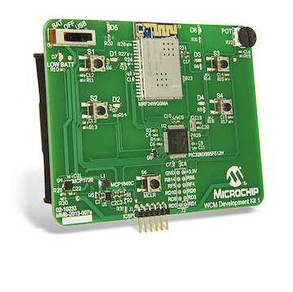

# Microchip WiFi Client Module Development Kit 1

The Microchip WiFi Client Module Development Kit 1 (DM182020) is designed to enable users to quickly and easily connect to a cloud based service such as Exosite's OnePlatform. The kit includes the WCM demo board utilizing a Microchip MRF24WG0MA WiFi Module and a PIC32 application microcontroller.

The WiFi Client Module Development Kit 1 is available from Microchip Direct or other distributors.

# Downloads and Links

* [Quick Start Guide](https://github.com/exosite-ready/er_vfp_microchip_wcm)
* [Exosite's Microchip Portal](https://microchip.exosite.com/)
* [Microchip Direct Store](http://www.microchip.com/stellent/idcplg?IdcService=SS_GET_PAGE&nodeId=1406&dDocName=en560904)
* [Microchip IoT](https://www.microchip.com/iot/)

# About

The Microchip WCM-DK1 is the first product to be certified as ExositeReady™ which certifies that a production ready port of the ExositeSDK™ is available and ready for use in your application. The provided demo shows the following:

* Quickly activate a new device on Exosite cloud and save CIK to NVMemory.
* Periodically send 'Heart Beat' data to draw a triangle wave to Exosite cloud.
* Send button press report to Exosite cloud to trigger an email or sms alert.
* Read 'LED' data source on Exosite cloud to turn device LED1 on and off.

# Support

* [Exosite's Community Forum](https://community.exosite.com)
* [Microchip 24/7 Tech Support Website](http://www.microchip.com/wwwregister/default.aspx?ReturnURL=http://www.microchip.com/support/hottopics.aspx)
* [Microchip Support Forums](http://www.microchip.com/forums)
