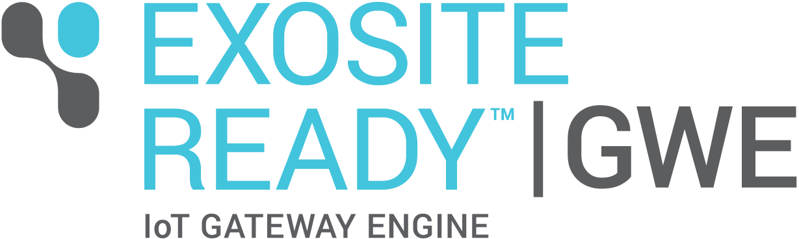

# ExositeReady™ Gateway Engine

# 

ExositeReady™ Gateway Engine (GWE) was created by Exosite to service a commonly occurring
design pattern in IoT applications. This page provides information about
what GWE does and does not do, as well as a list of the terms 
used and the additional resources available. 

# Resources

* [Getting Started](getting_started)
* [Product Overview](product_overview) 
* [Release Packages](release_packages)
* [Custom Gateway Applications](custom_gateway_applications)
* [Over the Air Updates](otau)
* [GWE Solution App](solution-app)
* [Device Client - Docs](device-client)
* [GWE - Docs](gateway-engine)
* [Gateway Message Queuing - Docs](gmq)

# About GWE 

## What is a Gateway?

In the context of IoT, a "gateway" can be loosely defined as any device
that serves as a communication broker for other devices. Gateways, in
this context, often bridge the gap between an IoT platform (Exosite) and
some collection of devices that do not possess the ability of
communicating on the Internet. Sometimes the "devices"
generating the data you want on the Internet are not devices, per se, but
data from other networks the gateway can access such as modbus and CAN.
Either way, the purpose of any gateway is to move local data to an
external agent on the Internet.

Since using gateways is common throughout so many industrial
applications, Exosite created GWE as an out-of-the-box developer 
and deployment tool for Internet-connected gateways.

## What GWE Does

* It is the product that installs and modifies software over the air
    in a secure and scalable manner.
* It is an application-hosting framework for Custom
    Gateway Applications.
* It provides an Exosite API library in Python called `device-client`.
* It is integrated with [Supervisor](http://supervisord.org) to manage
    your Custom Gateway Applications' runtime environment.

## What GWE Does Not Do

* It does not read any sensor data.
* It does not auto-discover any connected nodes or sensors and
    automatically send data.
* It does not know what a Custom Gateway Application does.

# Terminology

| Term          | Definition    |
| ------------- | ------------- |
| CIK           | An acronym for Client Interface Key. The CIK is the authorization for operations like reading and writing data to dataports, creating new clients, dataports, and scripts, and even dropping (aka deleting) the client.  |
| Custom Gateway Application  | This is the application you (the developer) develop as your IoT solution. It is the application GWE hosts on your gateway(s).  |
| GWE | A Python framework for creating Custom Gateway Applications on Linux gateways. |
| `"GatewayEngine"` | The Python package in the GWE framework developed and maintained by Exosite Professional Services.|
| GWE | An acronym for Gateway Engine and/or `"GatewayEngine"`. |
| Vendor | An Exosite One Platform term that refers to an account name. |
| OTAU | An acronym for Over the Air Update. This is the mechanism that enables software and firmware updates over Internet connections. |
| tarball | A type of compressed file that contains other files, directories, and even other tarballs. |
