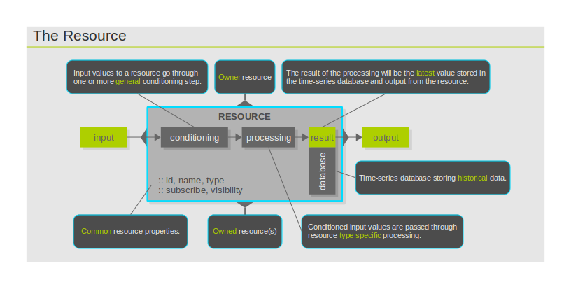

The Resource
============

Real world entities of significance to the One Platform are internally
represented as resources. Things that have significance are users of the
One Platform, their sources of data connected to it and the definitions
of how data should be processed or acted upon. The general internal
structure of a resource as well as its hooks to the inner workings of
the One Platform are depicted in the diagram 'The Resource'.

The hooks on the top and bottom play roles in the organization and
management of resources. The hooks on the left and right side allow the
resource to be plugged into a data processing flow. Input values will
enter the resource from the left and output values will exit on the
right.

Description
-----------

The description of a resource defines how it operates and whether it is
accessible by clients other than its ancestors. The description fields
that are common across all types of resources are discussed in this
chapter. Additional, resource type specific description fields are
discussed under the respective resource headings accessible from 'Types'
section.

-   [Description](resource_description.md)

Metadata
--------

Clients that have access to a resource can associate metadata with the
resource.

-   [Metadata](resource_metadata.md)

Types
-----

While every resource in the One Platform, regardless of what external
entity it represents, shares a common internal structure and external
set of hooks, four types have been designed to optimize the overall
operation of the One Platform.

-   [Client](resource_type_client.md)
-   [Dataport](resource_type_dataport.md)
-   [Datarule](resource_type_datarule.md)
-   [Dispatch](resource_type_dispatch.md)

Organization and Management
---------------------------

Various aspects of the One Platform operation, such as resource
identification and enumeration, access control and sharing, are based on
the internal organization and management of resources.

-   [Identification](resource_identification.md)
-   [Hierarchy](resource_hierarchy.md)
-   Access control (TODO)
-   [Sharing](resource_sharing.md)

Data Processing
---------------

The general operation of a resource can be described as follows. Input
values fed to the resource are passed through zero, one or more
preprocessing step. These steps are generic, independent of the resource
type. Next, the preprocessed values reach the main processing phase,
which is resource type specific operation. Results produced by the main
processing phase are stored in a dedicated time series database and,
upon successful storage, they are output from the resource.

-   [Input](resource_input.md)
-   [Preprocessing](resource_preprocessing.md)
-   [Processing](resource_processing.md)
-   [Storage](resource_storage.md)
-   [Output](resource_output.md)

