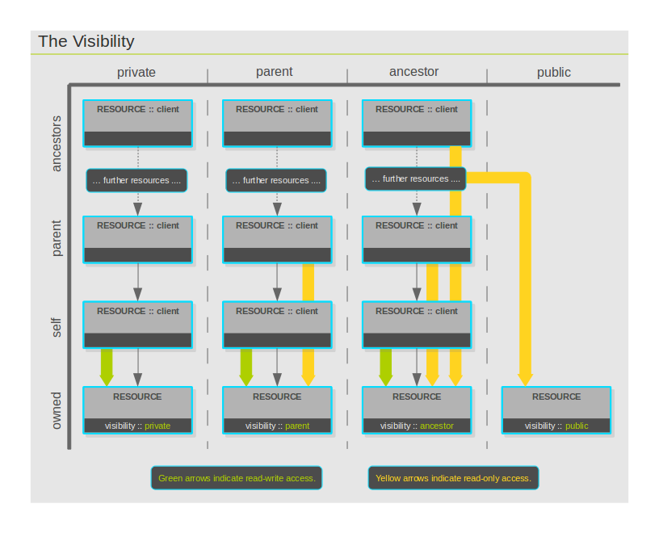

Access control
==============

Mechanisms are in place that determine and control who has what type of
access to which resource. The mechanisms rely on a resource's so-called
visibility, the type of relationship it is in with the accessing client
and whether or not the resource is shared with the client. Each of the
above aspects is elaborated on in the following subsections.

Visibility and relationship
---------------------------

The relationship between two resources resulting from the tree
hierarchy, and the 'visibility' property of a resource, ultimately
determine its visibility to another resource. The diagram below depicts
all possible scenarios. As shown in the diagram 'The Visibility', the
visibility of a resource is always specified by, and from, its owner's
point of view. For example, a client setting an owned resource's
visibility as 'parent' gives the client's parent access to the resource.
Public resources are visible to any other resource regardless of their
relative positions in the hierarchy tree.

Note, that a parent or ancestor client can always traverse the ownership
chain and connect to the One Platform as the direct owner of a resource,
thereby, gaining full access to it. Hence, the visibility of a resource
only determines the type of access an ancestor or parent has as itself.

Sharing
-------

In case a client wants to grant another client, that is not in the same
ancestor line, access to one of its resources, it can do so without
making the resource's visibility public. It can share the resource with
that particular client. With the sharing feature, the One Platform
allows relationship to be established between any two resources in the
system. The process of how a resource is shared is described in the
section 'Sharing' under 'Resource'.

Access types and precedence
---------------------------

Currently, four access levels are defined for resources in the One
Platform: full, self, read-only and none. If a client has more than one
way to access a resource, the type of access is determined in the
following order of precedence:

### Full

If a client owns a resource, it will have 'full' access to it,
unaffected by the resource's visibility. Full access allows clients to
read from, subscribe to, write to, query information about and fully
manage a resource. Currently, only the direct owner of a resource has
these rights to the resource.

### Self

If a client is accessing itself, the type of access it has is 'self'
access and will not be affected by its visibility. Clients have access
to themselves to a limited extent. Self type of access has been invented
for two reasons: 1) to allow clients to view information about
themselves that read-only access would otherwise not allow; 2) limit the
types of actions a client could do if it had full access to itself.
Currently, the only difference from read-only access is the type of
information that a client can obtain about itself. For specifics, refer
to the 'info' API.

### Read-only

Read-only access, which allows a resource to be read from, subscribed to
and information queried about, is granted in either of the following
cases:

-   due to the combined effect of visibility and hierarchical position
    of the resource relative to that of the accessing client,
-   due to the resource being shared with the accessing client,
    unaffected by the visibility of the resource,
-   because the resource's visibility is public.

### None

Absolutely no access is granted for non-public resources when a client
has no ancestor or shared relationship with the resource. Any and all
actions attempted on their behalf on the resource will cause the error
'restricted' to be returned.
