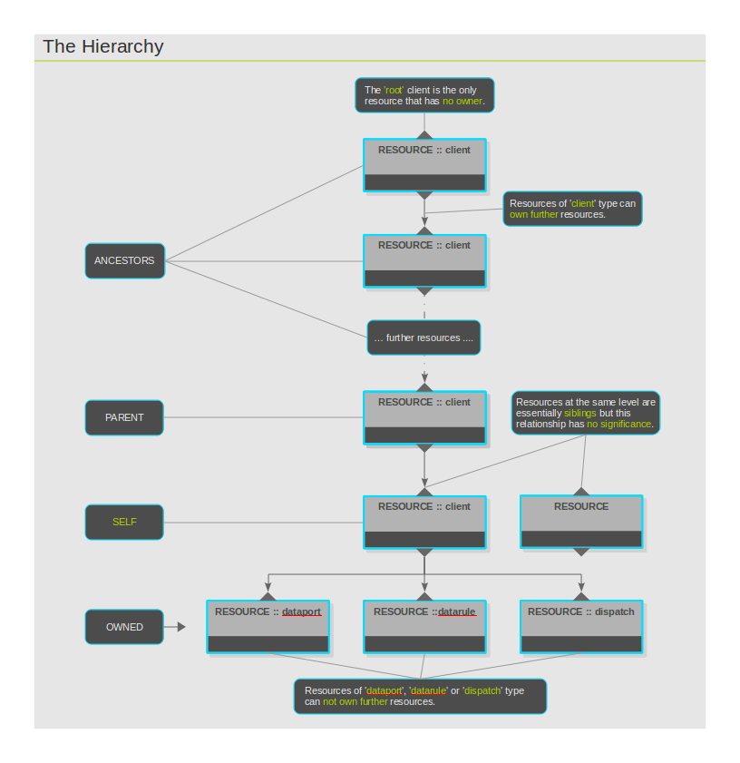

Hierarchy
=========

Resources inside the One Platform are organized hierarchically. Every
resource has a single owner and 'client' type resources may own zero,
one or more resource. Exceptions to this rule are the topmost client, or
'root', which has no owner, and resources of type other than 'client'
which can not own further resources. When a resource is created, the
client creating it will become the owner of the new resource. From the
viewpoint of any client in the One Platform, for operational reasons,
there are four levels of relationship defined between resources: owned,
self, parent and ancestor. Same level resources, or siblings, and
resources in different ownership lines, are considered unrelated. The
diagram 'The Hierarchy' visualizes this concept.

