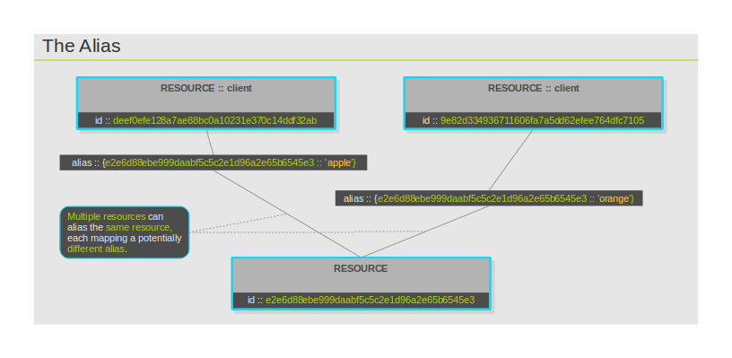
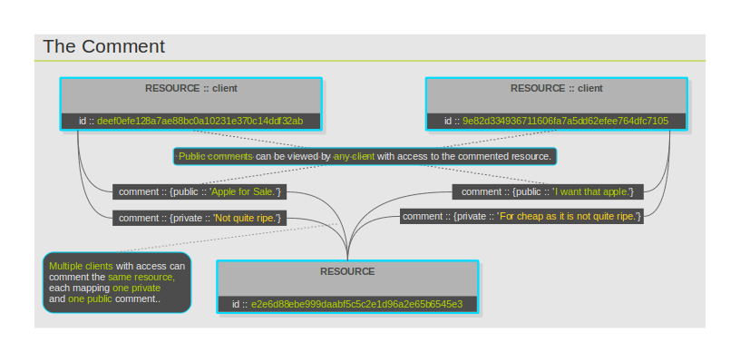

Metadata
========

Metadata is considered to belong to the associating client and not the
resource it is associated with. Thus, different clients can associate
with the same resource different values of the same property. Metadata,
by which a resource can be identified, is specified for resources using
the 'map/unmap' API and can be queried using the 'info' API. In order to
find a resource using metadata attached to it, the 'lookup' API can be
used. Metadata, by which a resource can not be identified, has its own
API and is noted accordingly. The following types of metadata are
defined for resources:

### alias

Resources are identified by their random, 40-character hexadecimal
identifiers. Aliases offer an alternative, human readable way to
identify resources. With the One Platform API, everywhere a resource
identifier is accepted as an argument, an alias for the resource is also
accepted. Multiple clients can alias the same resource, each potentially
mapping a different alias. The alias must be a string of up to 250
characters in size. For further information, reference the
'map/unmap/lookup' API. The diagram 'The Alias' depicts the concept of
aliases.

### comment

Comments provide a way for users to describe their resources in human
comprehensible terms. Comments have no functional role in the operation
of the One Platform and resources can not be looked up by comments. They
are purely a note to users that can access the resource. Multiple
clients can maintain their own comments for the same resource. Comments
can be private or public. Every client can associate one private and one
public comment per resource. Private comments can only be viewed by the
client that had created the comment in the first place. Public comments
are visible to any client that has at least read-only access to the
commented resource. Use the 'comment' API to comment resources up to
1000 characters in length. The diagram "The Comment" visualizes how
comments work.

