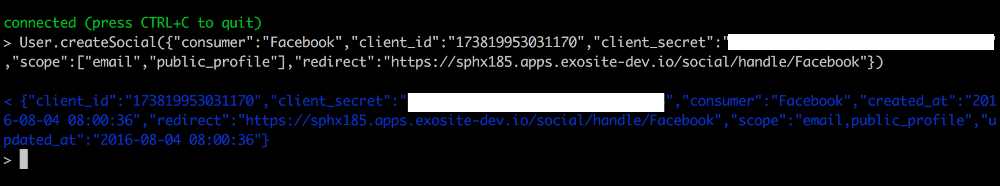
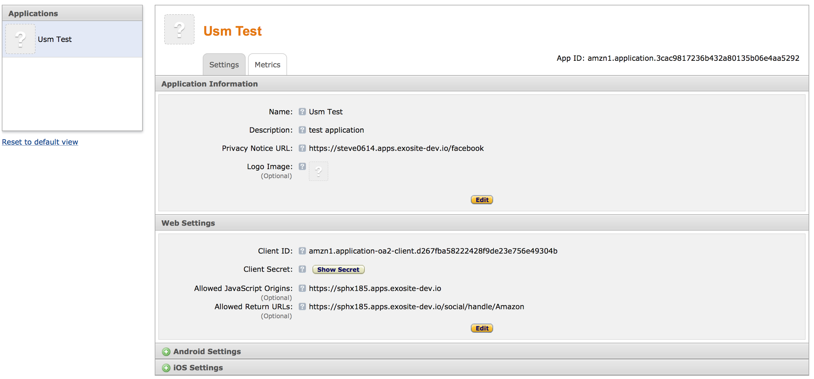
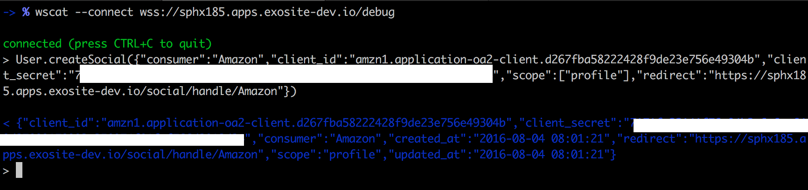
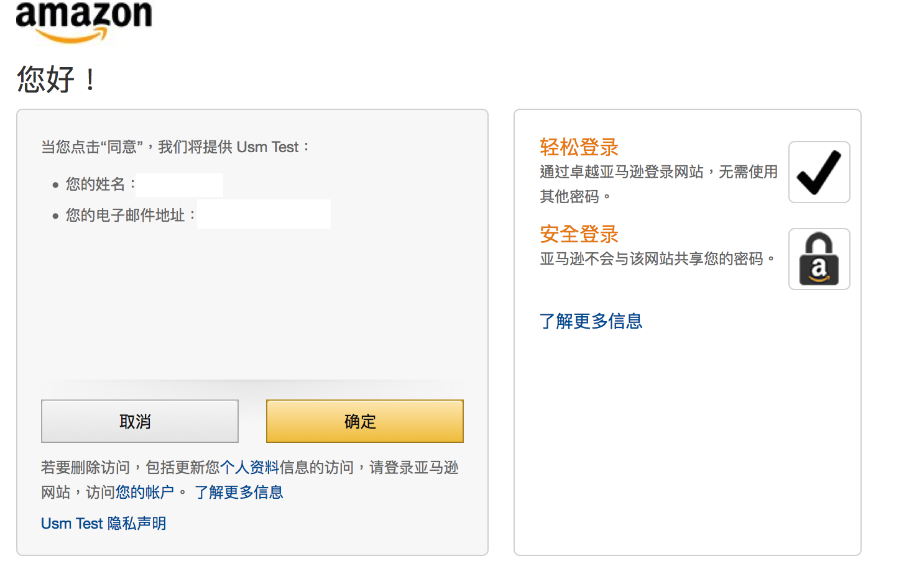
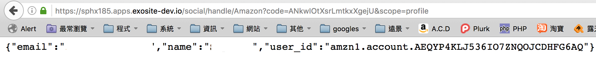
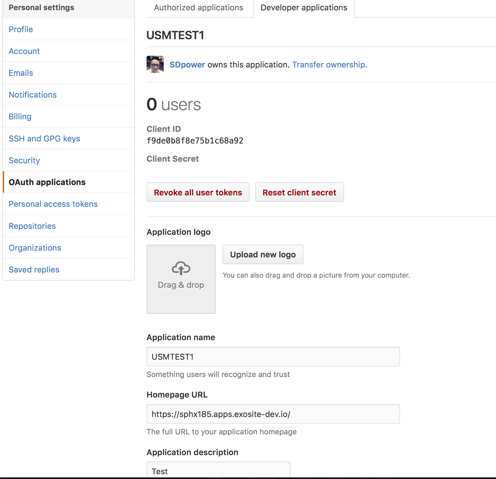
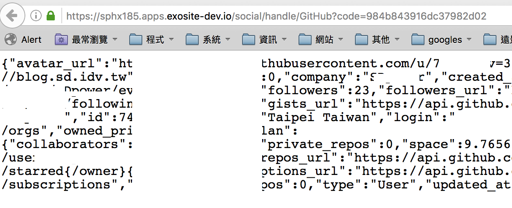
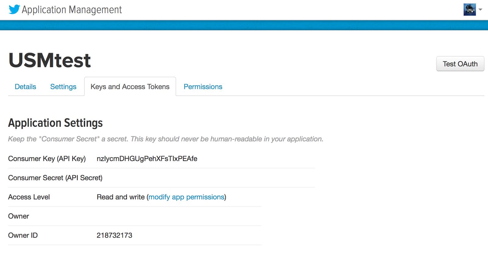
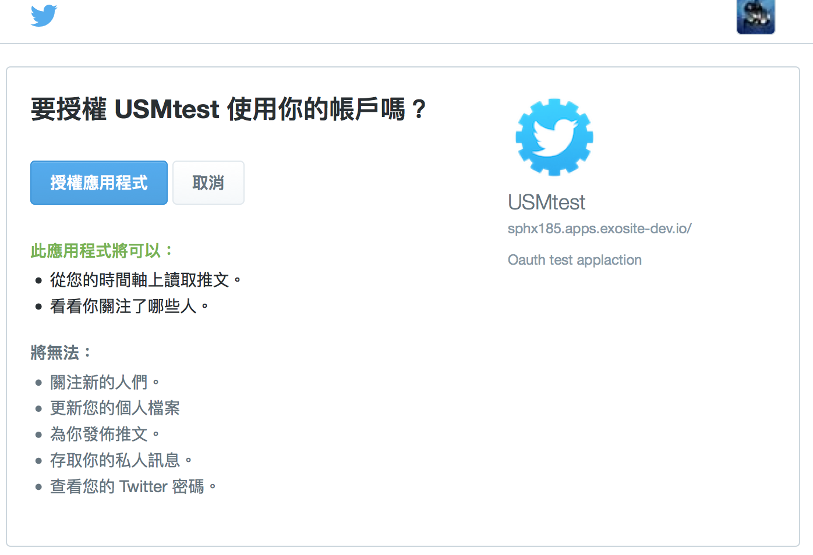
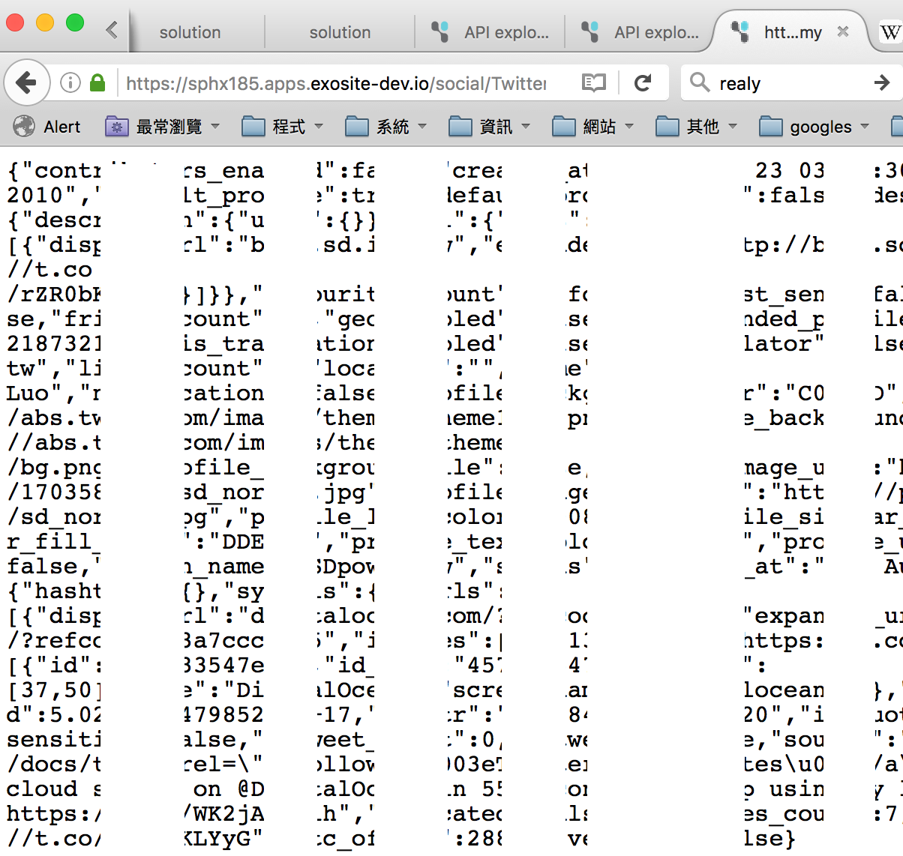

# Guide: Murano OAuth User

This document describes how to use the Murano User service to connect with an OAuth provider. This allows the end users of a solution to sign in using an existing identity such as Google or Facebook rather than using username and password.

# Function:

## createSocial
Description: Create a social.
Example:
```
User.createSocial({"consumer":"Google","client_id":"xxxxxxxxxx","client_secret":"xxxxxx","scope":["profile","email"],"redirect":"https://xxxxx.exosite.io/social/handle/Google"})
```
## getSocial
Description: Get social info.
Example:
```
User.getSocial({consumer="Google”})
```
## deleteSocial
Description: Delete a social.
Example:
```
User.deleteSocial({consumer="Google”})
```
## updateSocial
Description: Update the social info.
Example:
```
User.updateSocial({consumer="Google”,client_id=”213casdsad”})
```
## getSocialLoginUrl
Description: Get social login url.
Example:
```
User.getSociaLoginUrl({consumer="Google”})
```
## getSocialToken
Description: Get social login Token.
Example:
```
User.getSocialToken({consumer="Google”,code=”xxxxx”})
```
## socialRequest
Description: Request social get information.
Example:
```
User.socialRequest({consumer="Google”,token=”xxxxx”})
```

# Example

## Endpoints

First create the 2 endpoints on you solution.

```
--#ENDPOINT GET /social/handle/{consumer}/loginurl
-- This endpoint will redirect you to the social consumer login auth pages
response.headers["location"] = User.getSocialLoginUrl({consumer=request.parameters.consumer})
response.code = 303
```

```
--#ENDPOINT GET /social/handle/{consumer}
-- This endpoint is social consumer callback url
-- Get token then request information
results, err = to_json(request.parameters)
resultd, err = from_json(results)
local tokenstr = User.getSocialToken(resultd)
response.message = User.socialRequest({consumer=request.parameters.consumer, token=tokenstr})
```

## Google

Create an App on Google: [https://console.developers.google.com/](https://console.developers.google.com/)

Go to Credentials and create a new credential. It should be an OAuth client ID with type "Web Application".

	

Get the
```
 ClientID => Client ID

 Client_secret => Client secret
```

Add callback url.


Use websocket debug endpoint to add the google social connection.

```
Example: User.createSocial({"consumer":"Google","client_id":"xxxxxxxxxx","client_secret":"xxxxxx","scope":["profile","email"],"redirect":"https://sphx185.apps.exosite-dev.io/social/handle/Google"})
```


Test it:

Example: [https://sphx185.apps.exosite-dev.io/social/handle/Google/loginurl](https://sphx185.apps.exosite-dev.io/social/handle/Google/loginurl)



## Facebook

Create an App on Facebook: [https://developers.facebook.com/apps/](https://developers.facebook.com/apps/)


Get the:
```
 ClientID => App ID

 Client_secret => App Secret
```


Set the callback url.


Use websocket debug endpoint to add the Facebook social.

    Example: User.createSocial({"consumer":"Facebook","client_id":"xxxxxxxxxx","client_secret":"xxxxxx","scope":["email","public_profile"],"redirect":"https://sphx185.apps.exosite-dev.io/social/handle/Facebook"})



Test it.

Example: [https://sphx185.apps.exosite-dev.io/social/handle/Facebook/loginurl](https://sphx185.apps.exosite-dev.io/social/handle/Facebook/loginurl)


Success!


## Amazon

Go to Amazon doc: [http://login.amazon.com/website](http://login.amazon.com/website)

Register your website as an Application on the App Console.



Get the: 
```
 ClientID =>  Client ID

 Client_secret => Client Secret
```

Use websocket debug endpoint to add the amazon social.

```
Example: User.createSocial({"consumer":"Amazon","client_id":"xxxxxxxxxx","client_secret":"xxxxxx","scope":["profile"],"redirect":"https://sphx185.apps.exosite-dev.io/social/handle/Amazon"})
```



Test it:

Example: [https://sphx185.apps.exosite-d](https://sphx185.apps.exosite-dev.io/social/handle/Amazon/loginurl)

[ev.io/social/handle/Amazon/loginurl](https://sphx185.apps.exosite-dev.io/social/handle/Amazon/loginurl)



Success!



## GitHub

Create a new application on Github: [https://github.com/settings/applications/new](https://github.com/settings/applications/new)

Get the:
```
 ClientID =>  Client ID

 Client_secret => Client Secret
```



Use websocket debug endpoint to add the GitHub social.

```
Example: User.createSocial({"consumer":"GitHub","client_id":"xxxxxxxxxxxx","client_secret":"xxxxxxxxxxxxxxx","scope":["user"],"redirect":"[https://sphx185.apps.exosite-dev.io/social/handle/GitHub](https://sphx185.apps.exosite-dev.io/social/handle/GitHub)"})
```


Test it:

Example:  [https://sphx185.apps.exosite-dev.io/social/handle/GitHub/loginurl](https://sphx185.apps.exosite-dev.io/social/handle/GitHub/loginurl)




## Twitter

**Note:** Twitter is using OAuth1, not OAuth2, so it is different.

First create the 2 endpoints on your solution.

```lua
--#ENDPOINT GET /Twitter/login
-- This endpoint will redirect you to the social consumer login auth pages
local qToken =  User.getSocialLoginUrl({consumer="Twitter"})
local url = User.getSocialLoginUrl({consumer="Twitter",reqToken=qToken})
response.headers = {
  ["location"] = url,
  ["Set-Cookie"] = "token=" .. qToken .. "; Path=/social/Twitter;"
}
response.code = 303
```

```lua
--#ENDPOINT GET /social/Twitter/handle
-- This endpoint is social consumer callback url
-- Get token then request information
local Headers = request.headers
local Token = string.gsub(Headers["cookie"], "token=(%w+)", "%1")
local params= request.parameters
params.reqToken = Token
params.consumer = "Twitter"
local aToken = User.getSocialToken(params)
response.message = User.socialRequest({consumer= "Twitter", token=aToken})
Create a new application on Twitter[ h](https://apps.twitter.com/)
```




Use websocket debug endpoint to add the GitHub social.

Example: User.createSocial({"consumer":"Twitter","client_id":"232131231","client_secret":"xxxxxxxxxxxxxxxxxx","redirect":"https://sphx185.apps.exosite-dev.io/social/Twitter/handle"})


Test it.

Example:  [https://sphx185.apps.exosite-dev.io/Twitter/login](https://sphx185.apps.exosite-dev.io/Twitter/login)





