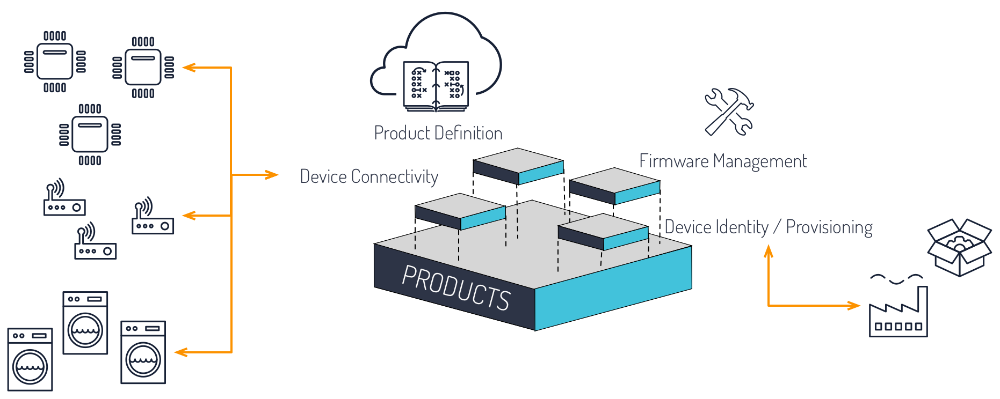

# Murano Platform

<table class="tocmenu" width="100%">
    <tr>
        <td>[Introduction](#introduction)</td>
        <td>[Getting Started](#getting-started)</td>
        <td>[Features](#features)</td>
        <td>[Architecture](#architecture)</td>
    </tr>
</table>

# Introduction
The Murano hosted software platform allows you to deploy full IoT solutions, from device to user applications by providing tools, infrastructure, and example starting templates.  IoT is more than just connecting things to the internet - it is a mash-up of resource-constrained `things` (not computers) and overlaying concepts of `application logic`, `user roles / permissions`, and `business integration`.  Murano provides this `full stack` of IoT, already integrated allowing developers to focus on creating value and interesting functionality rather than building and maintaining infrastructure, protocols, and lots of integration work.

<a class="btn orange" href="https://exosite.com/business/signup">Get Started with Murano now</a>

# Getting Started
Getting started is easy and free.  After signing up, you'll be walked through the steps to set up a Product, connect a device (or device simulator), and interact with device data on a dashboard.  Murano will then provide the steps to walk through cloning a Solution Application and deploying it - allowing you to interact with your device via a fully custom web application in minutes.

Watch this tutorial

&nbsp;

<a class="btn orange" href="https://exosite.com/business/signup">Get Started with Murano now</a>

## Creating a Product
Murano walks you through adding a development kit or device simulator - as a example Smart Light bulb consumer product.  

## Creating a Solution
Murano walks you through cloning and deploying a sample Smart Light bulb consumer application.  

# Features
## Products

The core node or object in the platform is a 'client'.  A client typically represents a virtual device, but clients are also used for other purposes - such as for an account, a container of some kind, or a user.  These types of uses of clients generally are in regards to the ownership hierarchy.  A client can own or be owned by other clients.  

## Solutions
Each client has functional resources that allow for storing, processing, and taking action on data.  There are no limits to how many of each resource are used, although applications should optimize based on performance for things like user applications.

* [Dataports](#dataports) - Time series data stores
* [Datarules](#datarules) - Logical data rules on published data
* [Dispatches](#dispatches) - Triggered messaging
* [Scripts](#lua-scripts) - Lua scripts interacting with the other resources

## Business
Dataports are a simple data store of time stamped values that can be written and read from.  Data written to a dataport (Write function) is stored with a platform provided unix timestamp. Data written with the Record function uses a timestamp provided with the value.  

Dataports have type 'integer', 'float' or 'string'.  When using string types, the maximum size of a value that can be written is 64KB.  Formatted data, such as JSON can be stored as string type, with the JSON object written as a string.

An example of a dataport use is a device with a temperature sensor, the type being float.  Writing a value of 24.2 will result in the platform storing this value the timestamp in which it was received.  A user application with a graph may call the read API and request the last 5 minutes of data values.

Dataports can publish data to other dataports, datarules, and dispatches.  Scripts can read, write, and wait on dataports.  

# Architecture
x, y, z

# Help
Looking for answers you may have yet?  Check out the Exosite support site [knowledge base articles on the One Platform](https://support.exosite.com/hc/en-us/sections/200072527).
