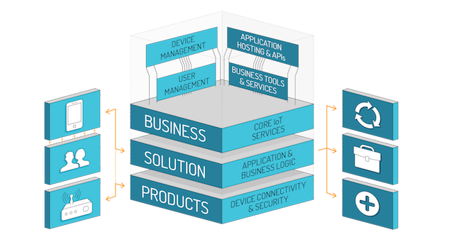
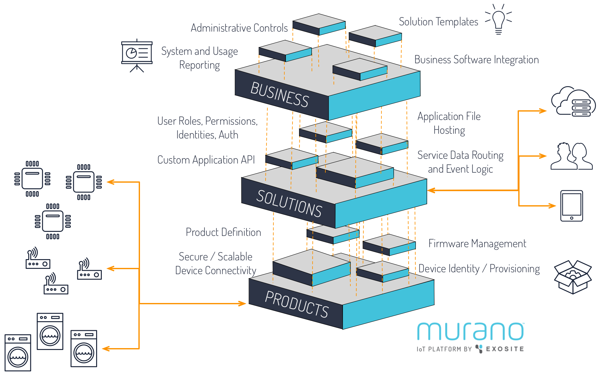

# Murano Platform

# Introduction
The Murano hosted software platform allows you to deploy full IoT solutions, from device to user applications by providing tools, infrastructure, and example starting templates.  IoT is more than just connecting things to the internet - it is a mash-up of resource-constrained `things` (not computers) and overlaying concepts of `application logic`, `user roles / permissions`, and `business integration`.  Murano provides this `full stack` of IoT, already integrated allowing developers to focus on creating value and interesting functionality rather than building and maintaining infrastructure, protocols, and lots of integration work.

<a class="btn orange" href="https://exosite.com/business/signup">Sign Up for Beta Access to Murano</a>

# Architecture
They began to meet more people. For the most part these were staring before them, murmuring indistinct questions, jaded, haggard, unclean. One man in evening dress passed them on foot, his eyes on the ground. They heard his voice, and, looking back at him, saw one hand clutched in his hair and the other beating invisible things. His paroxysm of rage over, he went on his way without once looking back.
As my brother's party went on towards the crossroads to the south of Barnet they saw a woman approaching the road across some fields on their left, carrying a child and with two other children; and then passed a man in dirty black, with a thick stick in one hand and a small portmanteau in the other. Then round the corner of the lane, from between the villas that guarded it at its confluence with the high road, came a little cart drawn by a sweating black pony and driven by a sallow youth in a bowler hat, grey with dust. There were three girls, East End factory girls, and a couple of little children crowded in the cart.
