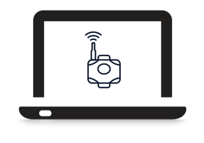
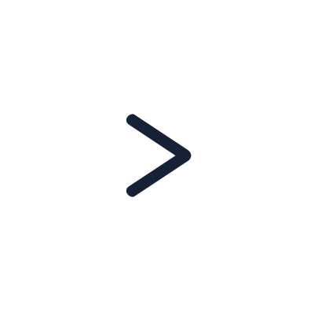
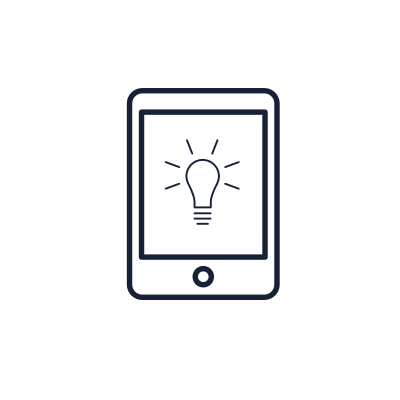

# Getting Started with Murano

Exosite provides example templates to help you quickly create Products and Solutions on Murano. This includes everything you need to set up a Product, connect a physical device (or device simulator), interact with device data on a custom dashboard, and deploy a fully customizable front-end web application Solution. When finished, you will have a complete end-to-end IoT application deployed on Exosite’s Murano platform.

# Create a Product

In this section, you will create a connected lightbulb from the provided example templates. Choose an example template below based on whether you will use software-simulated devices, a SparkFun ESP8266 Thing Dev Board, or manual API commands. 

At the end of each getting-started guide, you should have either a physical or simulated device representing a connected lightbulb that is:

* Connected to the Murano platform

* Reporting sensor data

* Remotely controllable 

<table width="100%">
    <tr>
      <th colspan="2" style="font-weight: bold;">Murano Products - Getting-started Example Templates</th>
    </tr>
    	<tr>
        <td style="text-align: center;"></td>
        <td style="width:80%;padding-top:40px;padding-bottom:40px;">[Simulate a Device Using a Python Script](products/pythonsim)</td>
    </tr>
	<tr>
        <td style="text-align: center;"></td>
        <td style="width:80%;padding-top:40px;padding-bottom:40px;">[Use an IoT Thing Dev board by Sparkfun - Arduino-Based Example Code and Hook-up Guide](products/esp8266_thingdev_murano_smart_lightbulb)</td>
    </tr>
    <tr>
        <td style="text-align: center;"></td>
        <td style="width:80%;padding-top:40px;padding-bottom:40px;">[Manually Activate and Write Data using API Commands](products/manualdevice)</td>
    </tr>
    
</table>

# Create a Solution

In this section, you will clone and deploy an example consumer application for the connected lightbulb you created in the previous section. The example consumer application templates below provide all the source code and configuration necessary to complete this task.  

At the end of this getting-started guide, you should have a deployed web application that has:

* Unique user signup and login

* Ability for users to claim ownership of devices

* Ability for users to see device sensor data and turn the lightbulb on/off

* Ability for users to invite a shared user to access the lightbulb

<table width="100%">
    <tr>
      <th colspan="2" style="font-weight: bold;">Murano Solution - Getting-started Example Templates</th>
    </tr>
    <tr>
        <td style="text-align: center;"></td>
        <td style="width:80%;padding-top:40px;padding-bottom:40px;">[Create a Murano Solution Application](solutions/exampleapp)</td>
    </tr>
</table>    
