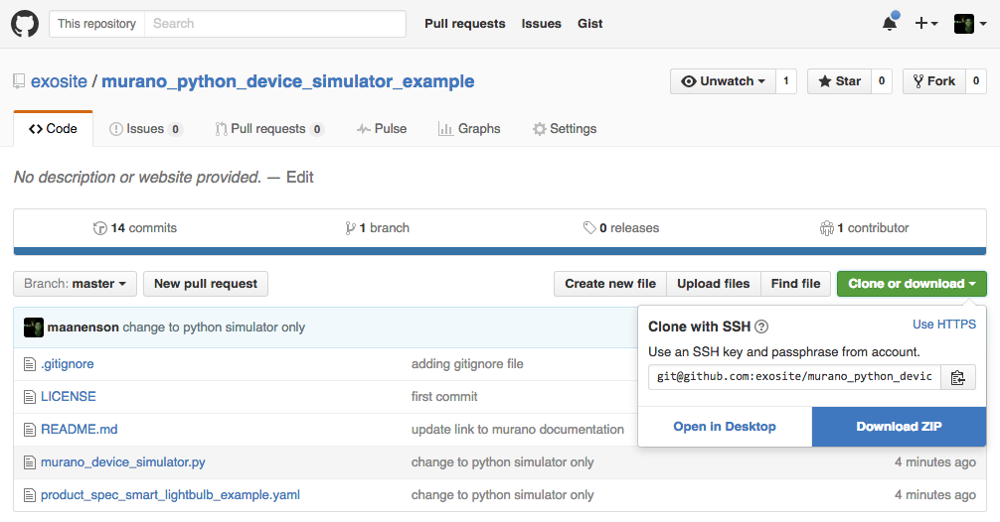
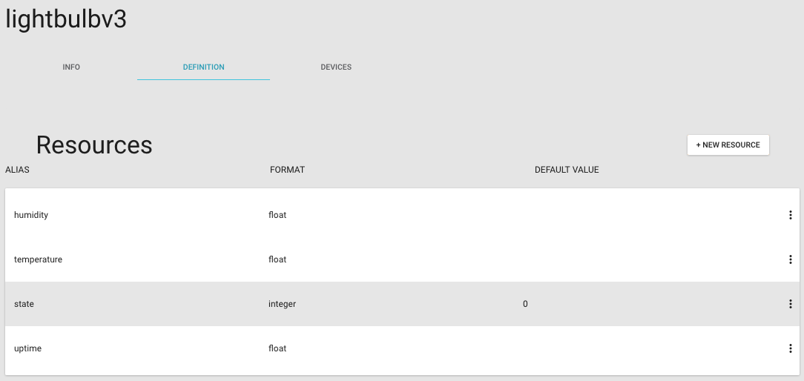
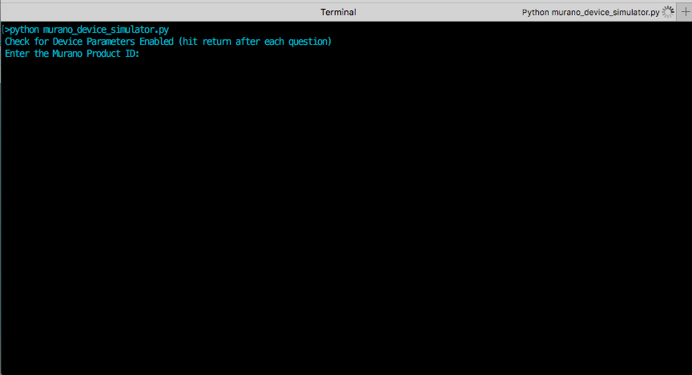
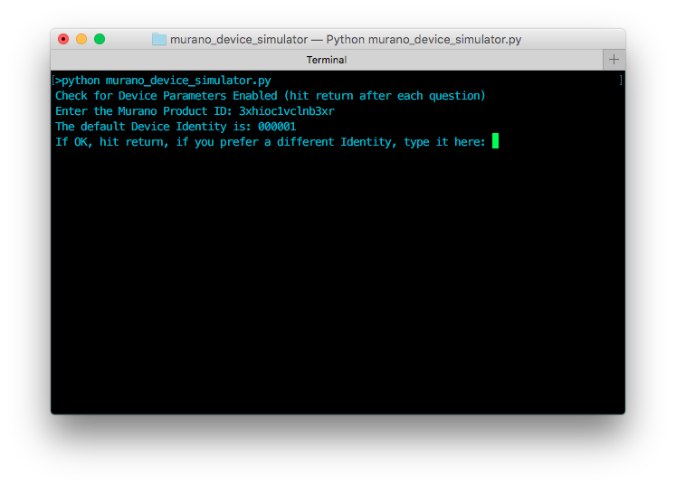
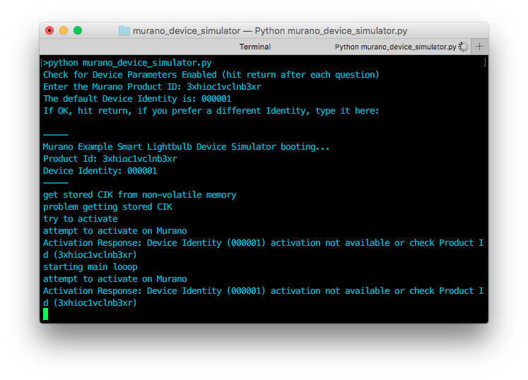
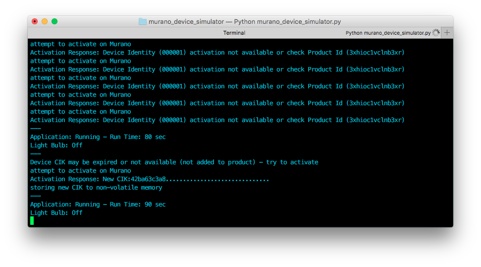

# Murano Example - Python Simulator Script Smart Lightbulb

This example walks through using a [Python](https://en.wikipedia.org/wiki/Python_(programming_language) script to act as a Smart Lightbulb with Murano.  Users can feel free to customize after walking through this guide as you'll have created a full Product instance that supports a deployment of devices specific to that Product. Product definition can be updated and more devices can be added.  After walking through these steps, users will be interacting with simulated device data (generated from your computer running the script) using a prototype developer dashboard tool. After this, users can go through the Murano Solution examples to deploy an Example consumer web application that works with this product demo.

Note: This simulator script uses the [Device HTTP API](/murano/products/device_api/http).


# Hardware Setup
There is no hardware used for this example, only your computer that can run a Python script.

# Software Setup
0. Download and Install Python (if you haven't used it before) [https://www.python.org/](https://www.python.org/downloads/)

1. On the [Github repository](https://github.com/exosite/murano_python_device_simulator_example), either Clone the repository project using git or download using Download Zip.

  

2. If you downloaded the zip, unzip.  Go into the folder and note the location of the murano_device_simulator.py file.  You will run this in a later step.

  


# Murano Product Setup and Running the Simulator 
## Create Your Product.

1. Create a Product in Murano.  

   When creating a product, Murano allows you to use a `product template` spec file to setup the product definition. For this example, you can use the following url (copy the whole thing):

  ```https://raw.githubusercontent.com/exosite/murano_python_device_simulator_example/master/product_spec_smart_lightbulb_example.yaml```

  
  

  After creating a product, take note of the Product ID which will be used for the device simulation script in later steps.  The Product ID can always be found on the `Info` tab on the Product page.

  

  Your `Definition` tab should look like this:
  

  _Note: If you did not use the template previous step, you can manually set up your Product Definition. Go to the Product Definition Tab and set up your dataport resources as specified here. Also, set the default value for `state` to 0 so the device has a default value it reads to know to turn   on or off the LED. Click on the `state` resource in the Definition tab and write a 0 to the value._

  * alias: _temperature_, format: _float_
  * alias: _humidity_, format: _float_
  * alias: _uptime_, format: _integer_
  * alias: _state_, format: _integer_

  


## Run the Python Script
_You do not need to edit the python script code, it will prompt you for your Product ID and Device Identifier when you run it, although you can edit the code to have your details automatically included._

1. Run the murano_device_simulator.py script by launching a command terminal window and running the following command:

  ```python murano_device_simulator.py```

  

2. A command prompt will ask your for your Product ID.  Copy this from your Murano Product's Info tab and enter into the command prompt, then hit the 'enter' key.

   

   

3. Next, it will prompt you if you want to change the Device Identifier from the default of 000001.  Recommend to start with this, just hit the `enter` key to use 000001.   

   

4. The script should begin running and will mention that it is not activated.  Now is time to Add a Device to your Murano Product instance.

   

5. Add Device Identity 000001 to your Murano Product by going to the Devices tab in your product and clicking the `New Device` button.

  

6. The device should have added.  Checking back with the Terminal window, the script should show that it activated and stored the CIK.  

  

  

  Also, if you click on the Device's Resources tab, you should active data there.

  

## Run the Product Dashboard Developer Tool
1. On the Device page, click the 'Dashboard' tab - which is a link to the Murano Product Dashboard Developer Tool.  This opens a new browser tab.  
   
   
2. Add a pane, then add a widget to the pane.

  

3. Interact with live data, see changes in Script's log

  

  _Example: By toggling Dashboard widget that toggles the 'state' resource from 0 to 1, the script log will show the simulated light bulb turning on / off._

  

4. Done!
