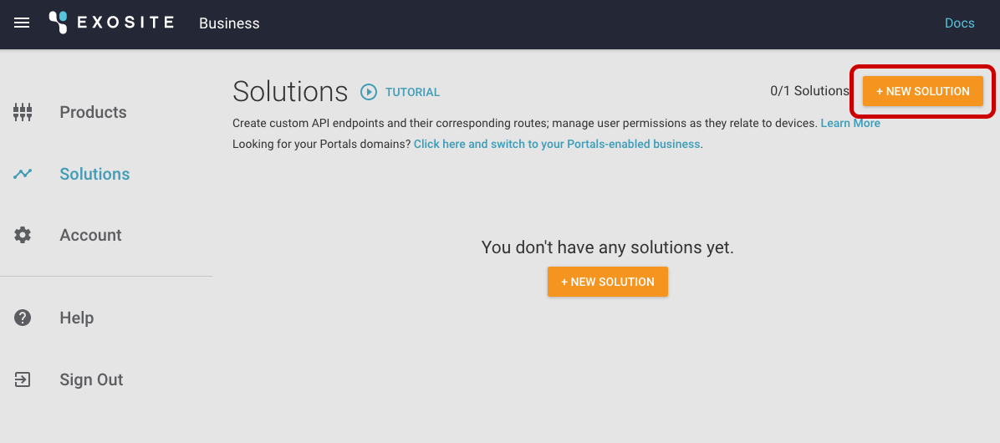
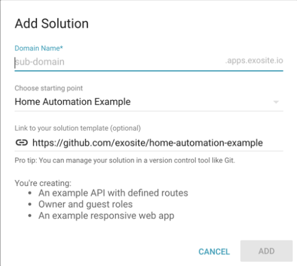
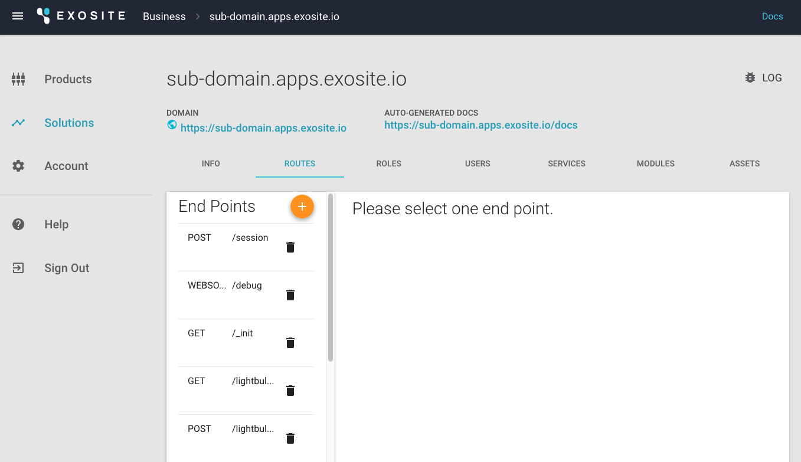
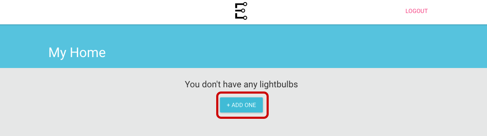
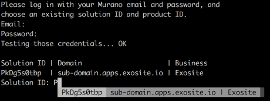
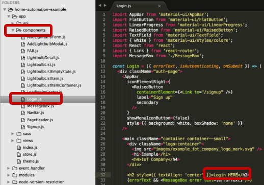
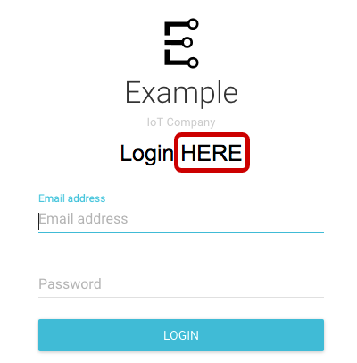

# GETTING-STARTED GUIDE: CREATE A SOLUTION & DEPLOY CHANGES

This is a getting-started guide for using Exosite Murano Solutions. In this guide, you will build, deploy, and use an example IoT application with the following features:

* User Login
* User Profiles
* Device Provisioning
* Real Time Device Data
* Device Control

If you do not already have a Murano account,
<a class="btn orange" href="https://exosite.com/business/signup">Sign Up for Beta Access to Murano</a>

# Requirements

## Hardware Setup

No hardware is required to complete this guide.

## Software Setup

In order to complete this tutorial, you will need Git, node.js & npm, and Python & pip installed on your system. 

**NOTE:** This is a technical tutorial. You will need some familiarity with your operating system’s terminal. 

# CREATE A SOLUTION USING THE HOME AUTOMATION EXAMPLE

Create a solution using the home automation example as a starting point here:
<a href="https://www.exosite.io/business/solutions" target="_blank">https://www.exosite.io/business/solutions</a>

**NOTE:** You may have to delete your previous solution if you are on a free account.



Notice, the Home Automation Example will pull in a public GitHub repository. If you are using your own GitHub repository in the future, it will not be linked to your solution (e.g., push to your GitHub repository and see changes on your solution). It consumes the repository when creating the solution, and you can push changes using the <a href="/development/tools/murano-cli/" target="_blank">Murano CLI</a>.





To verify the Template File worked, click the *ROUTES* menu item—you should see something like this: 


You have now created a custom API, owner and guest roles with device-level permissions, a responsive web app (which you will make changes to later), and an empty user database.


# LINK YOUR PRODUCT WITH YOUR SOLUTION

**NOTE:** If you have not created a product yet, create one here:
<a href="https://exosite.io/business/products" target="_blank">https://exosite.io/business/products</a>

You can plug all types of services into your solution. Products are linked to your solution as a "service," similar to the way you can integrate Twilio. You will continue to add services that you can plug in and save development time.

1) In your solution, click on the *SERVICES* tab <br />
2) Select *Product* <br />
3) Select the settings icon <br />
4) Select the products you want to include in the solution <br />
5) Click "APPLY" <br />


Your product is now linked to your solution and can be added as a device.


# SIGN UP FOR A NEW ACCOUNT ON THE WEB APP

1. Open your solution URL.
  

2. Sign up for an account on your new example app. <div style="background-color: #00BCD6; display: inline-block;">**NOTE:** You will not be able to login with your Exosite Murano credentials.</div> This is a totally separate application that you just deployed on the Murano platform, with a separate user database.

  If you used the Home Automation Example, it should look like this:
  

3. After signing up, click on the email verification link, then log in.

4. In the new web app, add a lightbulb using the identity of the device you added earlier (e.g., if you <a href="/quickstarts/lightbulb/" target="_blank">simulated a lightbulb using a Python script</a>, your device identity would most likely be "000001"). Click "ADD." 

  **NOTE:** If you have not added a device yet, it will throw an error.

  
  
  

5. Click to open your device. You should see data from the lightbulb—current humidity, temperature, and whether it is on or off. 

  **NOTE:** If you simulated a device using the Python Script, keep the script running so data will continue to flow into the application. It should look like this:


Congratulations—you have connected a device to your web app and are seeing live data.


# ADVANCED: DEPLOY CHANGES TO THE EXAMPLE SOLUTION 

1. Clone this GitHub repo: 

  ```
  git clone https://github.com/exosite/home-automation-example
  ```

2. CD to the directory:

  ```
  cd home-automation-example
  ```

3. Install the Exosite CLI:

  ```
  sudo pip install exosite
  ```

4. To confirm the Exosite CLI was installed correctly, type in: 

  ```
  exosite -h
  ```
  If it returns “command not found,” you may need to install pip with brew on your specific OS. 

  **NOTE:** There is a known issue in OS X—if you have upgraded to El Capitan, you may need to go around the built-in system dependencies on “six” by running:
  ```
  sudo pip install --upgrade exosite --ignore-installed six --ignore-installed prompt-toolkit --ignore-installed requests
  ```

5. Once you have confirmed the Exosite CLI was successfully installed, run the following three commands: 

  ```
  npm install
  ```
  ```
  npm run compile
   ```
  ```
  exosite --init
  ```

6. Log in with your Exosite credentials, and enter your product and solution IDs (hint: try the typeahead).
  

7. Make a change to *home-automation-example > app > components > Login.js*. Change the text from “Login” to “Login HERE” to make sure changes are deployed.
  

8. Compile your code:
  ```
  npm run compile
  ```

9. Deploy your solution from the top-level directory (you may need to CD back up to *home-automation-example* directory):
  ```
  exosite --deploy
  ```

10. Open the URL (cmd/ctrl + click to open in default browser, or copy paste the link):
  


Your changes have now been deployed: 




# SETTING UP LOCAL DEVELOPMENT

1. To run the web application static assets locally, create an .env file in the root of the project with your solution URL, like this (name it anything):

  API_BASE_URL=https://<solution-name>.apps.exosite-dev.io

  **NOTE:** The Chrome plugin in the next step may change the appearance of certain websites (e.g., GitHub.com) until you     disable it. You can easily disable the plugin by going to *Chrome > Preferences > Extensions > Disable ModHeader*.

2. Install this <a href="https://chrome.google.com/webstore/detail/modheader/idgpnmonknjnojddfkpgkljpfnnfcklj/related?hl=en" target="_blank">Google Chrome plugin</a> and import this configuration: 

  ```
  {"title":"Local Debugging","hideComment":true,"headers":  [{"enabled":true,"name":"","value":"","comment":""}],"respHeaders":[{"enabled":true,"name":"Access-Control-Allow- Origin","value":"http://localhost:8080","comment":""},{"enabled":true,"name":"Access-Control-Allow- Credentials","value":"true","comment":""}],"filters":[],"appendMode":""}
  ```
  

  

In your terminal:

3. CD to the *home-automation-example* directory and paste this command:
  ```
  npm run start:dev
  ```

4. Go to <a href="http://localhost:8080" target="_blank">http://localhost:8080</a> in your browser.

5. To push your solution changes to Exosite, simply run: 
  ```
  npm run compile 
  ``` 
6. Deploy your solution changes to Exosite:
  ```
  exosite --deploy 
  ```
  <div style="padding-bottom: 30px"></div>

You can now develop locally, compile your app, and push to the cloud.

<!-- Weaver's suggestion to add a link to learn more is valid and needed, but we don't talk about these things in the docs yet-->
<!--For more information about the powerful capabilities of Routes and Services (not to mention Hosting, Users, Roles and more, please check out <a href="../../">our getting started documentation</a>. -->
<div style="padding-bottom: 50px"></div>


Next up (if you have not already):
<a class="btn orange" href="http://docs.exosite.com/murano/get-started/">CREATE A PRODUCT >></a>
<div style="padding-bottom: 300px"></div>
